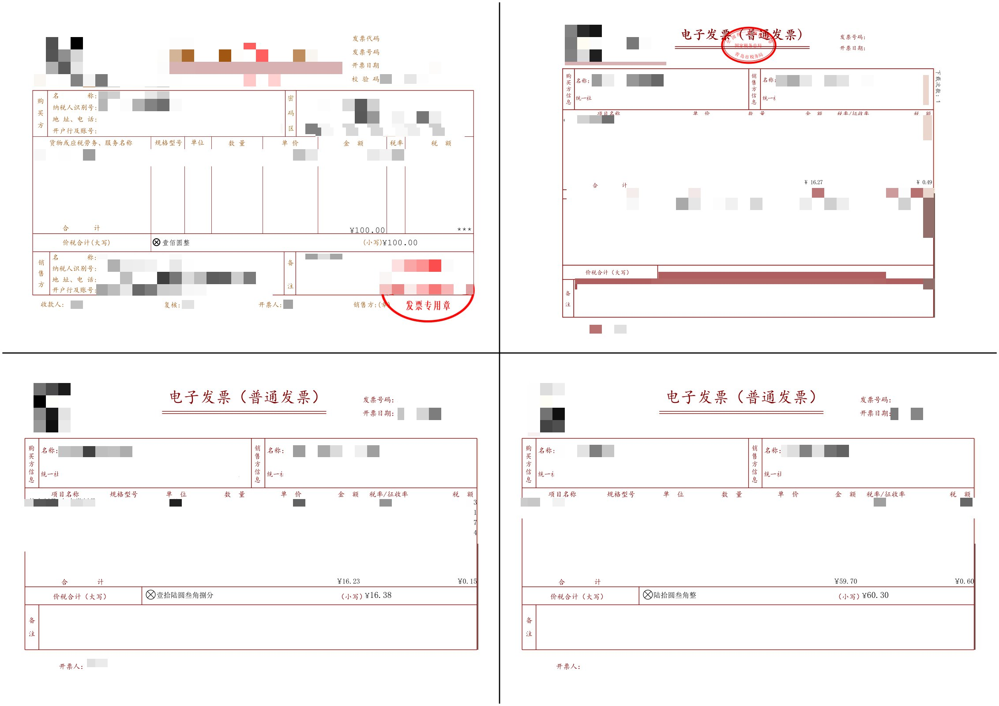

# PDF发票合并工具
 **GUI版：[mi2a4-gui](https://gitee.com/yzhcat/mi2a4-gui.git)** 

批量合并PDF发票工具，支持多种布局方式，将多个发票PDF文件合并到A4页面中。


## 功能特点

- 自动扫描指定文件夹中的所有PDF文件
- 支持多种布局方式：横版2x2、竖版1x2、竖版1x3、竖版2x4
- 支持多种对齐方式：左对齐、右对齐、居中对齐
- 支持命令行参数指定多个文件夹
- 支持从文本文件读取文件夹列表
- 自动处理输出文件名
- 自动提取并统计发票金额

## 使用方法

### 基本用法

```bash
# 合并指定文件夹中的PDF，使用默认布局（横版2x2），输出到默认文件out.pdf
python main.py folder1 folder2

# 指定输出文件名
python main.py folder1 folder2 output.pdf

# 指定布局（竖版1x3）
python main.py folder1 folder2 --layout=1x2_v

# 指定对齐方式（右对齐）
python main.py folder1 folder2 --align=right

# 同时指定布局和对齐方式
python main.py folder1 folder2 --layout=2x4_v --align=left
```

### 布局选项

支持以下布局方式：

| 布局代码 | 描述 | 每页发票数 | 页面方向 |
|---------|------|-----------|--------|
| 2x2_h | 横版 2x2 | 4 | 横向 |
| 1x2_v | 竖版 1x2 | 2 | 竖向 |
| 1x3_v | 竖版 1x3 | 3 | 竖向 |
| 2x4_v | 竖版 2x4 | 8 | 竖向 |

### 对齐选项

支持以下对齐方式：

| 对齐代码 | 描述 |
|---------|------|
| left | 左对齐 |
| right | 右对齐 |
| center | 居中对齐（默认） |

### 使用文本文件

创建一个文本文件（如paths.txt），每行写一个文件夹路径,如果存在--layout=或--align=参数，会覆盖默认设置,第一行或最后一行如果是*.pdf，会作为输出文件名
```
./差旅补助
./出行住宿
--layout=2x4_v
--align=right
./餐饮发票
output.pdf
```

然后运行：

```bash
python main.py paths.txt
```

### 命令行选项

- `-h`：查看帮助信息和文本文件格式说明
- `--layout=<布局代码>`：指定布局方式，默认为2x2_h
- `--align=<对齐代码>`：指定对齐方式，默认为center

## 输出文件名规则

1. 默认输出文件名为 `out.pdf`
2. 如果命令行参数中第一个或最后一个参数以 `.pdf` 结尾，则将其作为输出文件名
3. 如果使用文本文件，文本文件中第一行或最后一行以 `.pdf` 结尾，则将其作为输出文件名

## 文本文件格式

文本文件每行一个路径，可以是：
- 文件夹路径
- 布局选项（格式：--layout=布局代码）
- 对齐选项（格式：--align=对齐代码）
- 输出文件名（以.pdf结尾）

示例：
```
D:/发票/差旅补助
D:/发票/出行住宿
--layout=2x4_v
--align=right
D:/发票/餐饮发票
merged_invoices.pdf
```

## 技术实现

- 使用PyMuPDF库处理PDF文件
- 支持多种布局方式，通过PDFLayoutsInfo类管理布局配置
- 支持多种对齐方式，包括左对齐、右对齐和居中对齐
- 自动缩放发票以适应分配的空间
- 在页面之间绘制分隔线
- 自动提取发票金额并统计总额
- 模块化设计，支持命令行和GUI两种使用方式

## 系统要求

- Python 3.x
- PyMuPDF库

安装依赖：
```bash
pip install PyMuPDF
```

## 打包EXE

- 参考[打包exe.md](./doc/build_exe.md)
