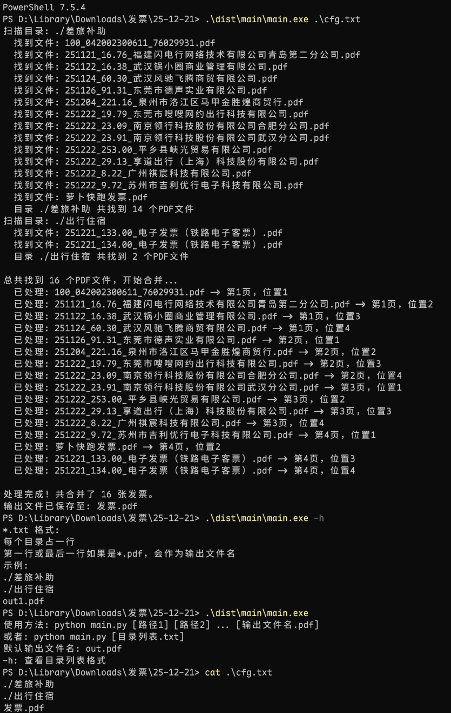

# 打包EXE方法总结

本文档总结了将PDF发票合并工具打包为可执行文件(EXE)的方法和步骤。

## 环境准备

1. 使用uv作为包管理工具
2. 确保已安装Python 3.13.5
3. 在项目目录下创建虚拟环境

## 打包步骤

### 1. 安装PyInstaller

```bash
uv add pyinstaller --link-mode=copy
```

此命令会安装以下依赖包：
- pyinstaller==6.17.0
- pyinstaller-hooks-contrib==2025.10
- 以及其他相关依赖

### 2. 执行打包命令

```bash
uv run pyinstaller -D --add-data ".\.venv\Lib\site-packages\fitz;fitz" .\main.py
```

参数说明：
- `-D`: 创建目录形式的可执行文件（推荐）
- `--add-data`: 添加额外的数据文件
  - `".\.venv\Lib\site-packages\fitz;fitz"`: 将fitz库文件包含进去
  - 格式为`源路径;目标路径`
- `.\main.py`: 要打包的主程序文件

### 3. 打包结果

打包完成后，会在以下位置生成文件：
- `dist/main/`: 包含可执行文件的目录
- `build/main/`: 构建过程中的临时文件
- `main.spec`: PyInstaller的配置文件

可执行文件位于：`dist/main/main.exe`



## 注意事项

1. **包含依赖库**：由于使用了PyMuPDF(fitz)库，必须通过`--add-data`参数将其包含进来，否则打包后的exe无法正常运行。

2. **目录形式打包**：使用`-D`参数创建目录形式的打包，比单文件打包(`-F`)更稳定，启动速度也更快。

3. **测试运行**：打包完成后，应在没有Python环境的机器上测试exe是否能正常运行。

4. **文件大小**：打包后的目录可能较大，这是因为包含了所有必要的依赖库。

## 常见问题解决

1. **缺少DLL文件**：如果运行时提示缺少DLL，检查`--add-data`参数是否正确包含了fitz库。

2. **路径问题**：使用相对路径时，确保exe运行时的工作目录正确。

3. **权限问题**：在某些系统上可能需要管理员权限运行。

## 替代方案

如果上述方法遇到问题，也可以尝试以下命令：

```bash
# 单文件打包（文件更大，启动更慢）
uv run pyinstaller -F --add-data ".\.venv\Lib\site-packages\fitz;fitz" .\main.py

# 使用spec文件进行更详细的配置
uv run pyinstaller main.spec
```

## 分发建议

1. 将整个`dist/main`目录压缩为ZIP文件进行分发
2. 提供简短的使用说明
3. 建议用户解压到非系统目录运行